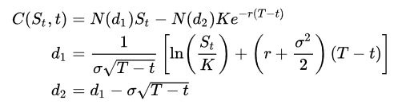

# Basics

## Some hints

### Tools
Anaconda, IPython, Spyder, Jupyter notebook...

### Versions, interpreters, documentation

v3.8
cpython, jython...
[python.org](https://www.python.org/)
Wikipedia...

### Zen of Python

```python
import this
```

### Data Types and Containers

int, float, strings, boolean
tuples, lists, dicts, sets

```python
i = 1
price = 1435.9
name = 'Hello'
is_ok = True

a = None

t = (1, 2, 3)
t2 = (1, 235.45, 'hello', True)
print(t[1])

l = [1,2,3]
l.append(4)
l.extend([5,6])

l[1]
l[1:3]
l[1:]
l[-1]
l[:-1]
len(l)

d = {'k1': 'A', 'k2': 'B'}
d['k3'] = 'C'

d.keys()
d.items()
d.values()
d['k3']

s = {1, 2, 3}
s = set([1, 2, 2, 3])

s.remove(1)
s.discard(1)

A = {1, 2, 3, 4, 5}
B = {4, 5, 6, 7, 8}

# intersection
A.intersection(B)
A & B

# union
A | B
A.union(B)

# difference
A - B
A.difference(B)
```
### Variable as reference

id(), is

### Mutable vs immutable

int, string, float, bool, tuple are immutable
list, set ... are mutable

## Control Structures

```python
for s in ('a', 'b', 'c'):
    print(s)


for s in 'hello':
    print(s)


for i in l:
    if i % 2:
        print(i)


#modulo:
9 % 2 == 1
#floor division
9 // 2 == 4

for i in range(10):
    print(i) 

i = 0
while i < 10:
    print(i)
    i += 1

i = 0
while True:
    i += 1
    print(i)
    if i // 4:
        break
```


### Functions

```python
def fibo(n):
    output = []
    a, b = 0, 1
    for i in range(n):
        print('a is replaced by b')
        print('b is replaced by a+b')
        output.append(a)
    return output
```

### global variables

```python
a = 1

def change_a():
    #global a
    a = 2

change_a()
print(a)
```


### List comprehension
```python
[i % 2 for i in range(10)]

[i for i in range(10) if not i % 2]
```

## Exercises

### Pricing of a european call option with the Black Scholes formula
Formula available here: https://en.wikipedia.org/wiki/Black%E2%80%93Scholes_model


```python

from math import log, sqrt, exp
from scipy import stats

# stats.norm.cdf --> cumulative distribution function
# for normal distribution

def bsm_call_value(S0, K, T, r, sigma):
''' Valuation of European call option in BSM model.
Analytical formula.
Parameters
==========
S0 : float
initial stock/index level
K : float
strike price
T : float
maturity date (in year fractions)
r : float
constant risk-free short rate
sigma : float
volatility factor in diffusion term
Returns
=======
value : float
present value of the European call option
'''
    return 0

c = bsm_call_value(100, 110, 2, 0.02, 0.1)
assert round(c, 3)== 3.391
```

### Toss a coin with a bias

```python
def toss():
    head = 0
    tail = 1
    bias=0.1
    #return head with a proba of 0.5 + bias

def find_the_bias():
    #call toss and use monte-carlo

```

# Advanced

## Functional programming

```python
def square(x):
    return x**2

def compute(func, values):
    return [func(i) for i in values]

compute(square, range(4))

map(square, range(4))

map(lambda x: x**2, range(4))

map(len, ["Lisa", "Rachid", "Franck"])

from functools import reduce

sum = reduce(lambda a,x: a+x, range(4))
concat = reduce(lambda a,x: a+x, 'hello')

filter(lambda x: not x %2, range(10)) shorter: range(10)[::2]

people = [{'name': 'Lisa', 'height': 160},
          {'name': 'Rachid', 'height': 180},
          {'name': 'Franck'}]
#How to get average height ?
```
## Generators

```python
def count(n):
    i = 0
    while i < n:
        i += 1
        yield i

a = count(10)
next(a)

b = (x**2 for x in range(10))
list(b)
list(b) #second time
```
Exercise: Re-write fibonacci as a generator with no limit

## Object oriented programming

### Simple class
```python
class Car(object):
    def __init__(self, buying_price):
        self.buying_price = buying_price

    def price(age_in_year):
        assert type(age_in_year) == int
        pass
        #every year, it decreases by 20%

prius = Car(20000)
prius.price(3)
prius.price(7)
```

### With abstract class

```python
from functools import reduce
from abc import ABC, abstractmethod

class Trade(ABC):
    """docstring for Product"""
    def __init__(self, expires):
        self.expires = expires

    @abstractmethod
    def pv(self, asofdate):
        pass

class Swap(Trade):
    def __init__(self, expires, notional, rate):
        super().__init__(expires)
        self.notional = notional
        self.rate = rate

    def pv(self, asofdate):
        return 1000

class Call(Trade):
    def __init__(self, expires, strike):
        super().__init__(expires)
        self.strike = strike

    def pv(self, asofdate):
        return 120

trade1 = Swap(2, 1000, 0.05)
trade2 = Call(2, 110)
asofdate = 2
portfolio = (trade1, trade2)
sum = reduce(lambda a,x: a+x, [p.pv(asofdate) for p in portfolio])
```

## Files and serialization

### Handling files

```python
with open('testfile.txt', 'w') as f: 
    f.write('hi there\n')
    f.write('I love Python')

with open('testfile.txt', 'r') as f: 
    for line in f: 
        print(line)
```

###Pickle

```python
import numpy as np

a = np.arange(1000)

import pickle

file=open("./data.pkl","wb") # open with write permission
pickle.dump(a, file)
file.close()

infile = open("./data.pkl",'rb')
b = pickle.load(infile)
infile.close()
```

## Pickle and bz2

```python
import numpy as np

a = np.arange(1000)

import pickle
import bz2

sfile = bz2.BZ2File('smallerfile', 'w')
pickle.dump(a,sfile)
sfile.close()

insfile = bz2.BZ2File('smallerfile', 'r')
b = pickle.load(insfile)
insfile.close()
```

## Introduction to multithreading

```python
import threading
import time


class MyThread(threading.Thread):
    def run(self):
        print("{} started!".format(self.getName()))              # "Thread-x started!"
        time.sleep(1)                                      # Pretend to work for a second
        print("{} finished!".format(self.getName()))             # "Thread-x finished!"

for x in range(4):                                     # Four times...
    mythread = MyThread(name = "Thread-{}".format(x + 1))  # ...Instantiate a thread and pass a unique ID to it
    mythread.start()                                   # ...Start the thread
    time.sleep(.9)                                     # ...Wait 0.9 seconds before starting another
```


